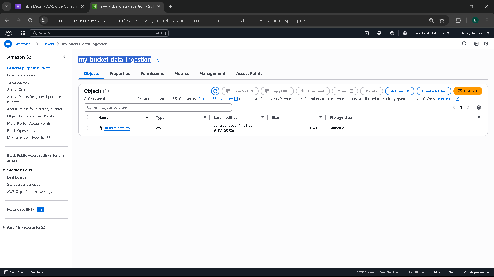
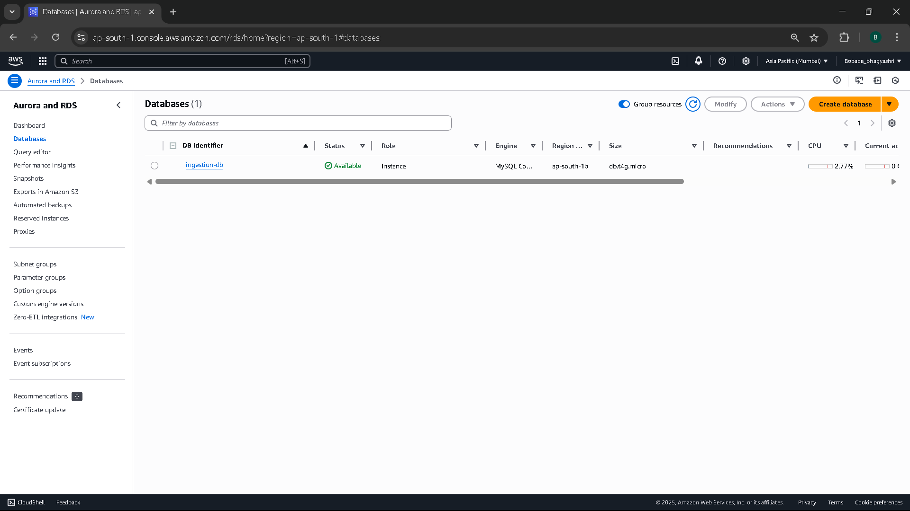
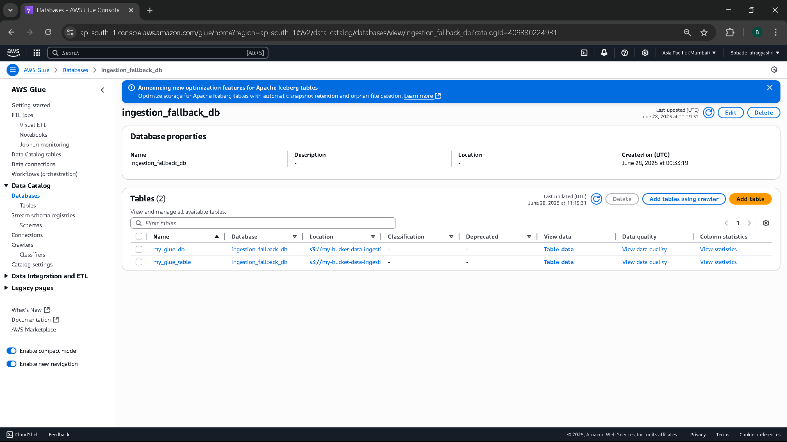
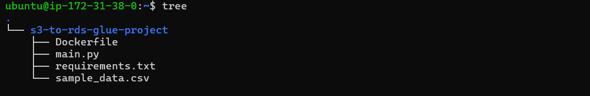
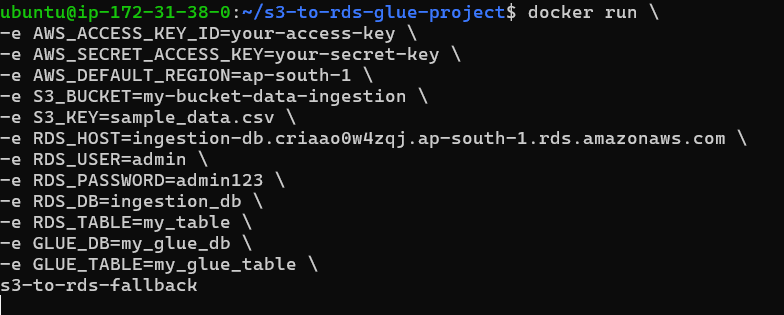
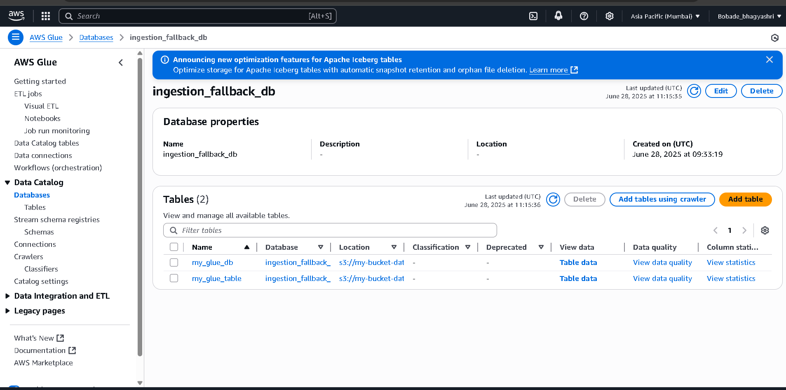
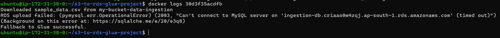

## 🚀  Data Ingestion from S3 to RDS with Fallback to AWS Glue using Dockerized Python Application


This guide is beginner-friendly and includes links to a full setup tutorial.

## 📦 Goal

1. Read CSV file from Amazon S3

2. Attempt to push to Amazon RDS (MySQL-compatible)

3. If the RDS connection/upload fails:

 Automatically fall back to AWS Glue Data Catalog Register the dataset and schema based on S3 file


## 📦 Table of Contents
- [📸 Architecture](#-architecture)
- [⚙️ Prerequisites](#-prerequisites)
- [🌐 AWS Setup Guide](#-aws-setup-guide)
- [🚀 Setup and Run](#-setup-and-run)
- [🚀 Final Output](#-final-output)
- [🌟 Why Use This Project?](#-why-use-this-project)
- [🙌 Who Should Use This?](#-who-should-use-this)

## 📸 Architecture

<p align="center">
  
</p>


## ⚙️ Prerequisites

✅ AWS Account ([Sign up here](https://aws.amazon.com/free/))  
✅ PowerShell (comes preinstalled in Windows 10/11)  


## 🌐 AWS Setup Guide

## 📋 Table of Contents
- [☁️ Step 1: Set up AWS Services (S3, RDS, Glue)](#-step-3-set-up-aws-services-s3-rds-glue)
- [🚀 Step 2: Launch EC2 Instance](#-step-1-launch-ec2-instance)
- [🐳 Step 3: Prepare EC2 Environment](#-step-2-prepare-ec2-environment)

 
## 🚀 Step 1: Set up AWS Services (S3, RDS, Glue)

### ✅ S3 Bucket
1. Create bucket `my-s3-data-bucket`.
2. Upload `data.csv`.
 
  <p align="center">
  
</p>


### ✅ RDS MySQL
1. Create RDS MySQL database `mydb`.
2. Enable public access.

<p align="center">
  
</p>

### ✅ AWS Glue
1. Create Glue Database.
2. Create Crawler for S3 data.

<p align="center">
  
</p>

## 🚀 Step 2: Launch EC2 Instance

1. Go to [AWS EC2 Console](https://console.aws.amazon.com/ec2/).  
2. Click **Launch Instance**.
3. Select **Amazon Linux 2 AMI**.  
4. Choose `t2.micro` (Free Tier).  
5. Configure Security Group:
   - Allow SSH (port 22), HTTP (80), and MySQL/Aurora (port 3306).
6. Create a key pair (download `my-key.pem`).  
7. Launch.  


## 🚀 Step 3: Prepare EC2 Environment

SSH into EC2 (from PowerShell on your computer):  
```powershell
ssh -i "C:\Path\To\my-key.pem" ec2-user@<EC2_PUBLIC_IP>
```

### 🛠️ Install Docker
```bash
sudo yum update -y
sudo amazon-linux-extras install docker -y
sudo service docker start
sudo usermod -a -G docker ec2-user
```


### 🛠️ Install Python 3
```bash
sudo yum install python3 -y
```
### 🛠️ Install Git
sudo yum install git -y


## 🚀 Setup and Run

### 🔥 Tree Structure

<p align="center">
  
</p>


### 🔥 Clone Repository
```powershell
git clone https://github.com/<your-username>/s3-to-rds-fallback.git
cd s3-to-rds-fallback
```

### 🐳 Build Docker Image
```powershell
docker build -t s3-to-rds-fallback .
```

### ▶️ Run Docker Container
```powershell
docker run -e AWS_ACCESS_KEY_ID=XXXXXX `
           -e AWS_SECRET_ACCESS_KEY=XXXXXX `
           -e AWS_DEFAULT_REGION=ap-south-1 `
           -e RDS_HOST=<your-rds-endpoint> `
           -e RDS_PORT=3306 `
           -e RDS_DB=mydb `
           -e RDS_USER=admin `
           -e RDS_PASSWORD=YourPassword123 `
           -e S3_BUCKET_NAME=my-s3-data-bucket `
           -e S3_FILE_KEY=data.csv `
           s3-to-rds-fallback
```


Run the container with required environment variables:


<p align="center">
  
</p>


## 🚀 Final Output
Once the project is set up and the Docker container is running, you will see logs showing the data ingestion process. 

### 🔁 Scenario 1: Fallback to AWS Glue

If the RDS upload fails, the script automatically registers the CSV in AWS Glue Data Catalog. 

📁 AWS Glue Fallback

<p align="center">
  
</p>

<p align="center">
  
</p>

<p align="center">
  
</p>


### 📜 Logs in Docker


<p align="center">
  
</p>


## 🌟 Why Use This Project?

| Feature                     | Benefit                                        |
|----------------------------|------------------------------------------------|
| 📦 Dockerized App          | Works on any OS with Docker                    |
| 🔁 AWS Glue Fallback        | No data loss if RDS fails                      |
| ☁️ Native AWS Services      | Production-ready pipeline                      |
| 🐍 Python Stack             | Uses boto3, pandas, SQLAlchemy, Docker         |
| 🔒 Secure Configs           | No hardcoded secrets, uses environment vars    |

## 🙌 Who Should Use This?

✅ Beginners exploring AWS  
✅ Students preparing for cloud interviews  
✅ Cloud engineers building fault-tolerant pipelines  

🙌 Thank You!

If you find this project useful, consider ⭐ starring the repo. Feedback and contributions are welcome!

